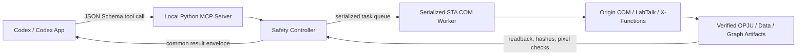

# Origin COM Automation

[English](README.md) | [简体中文](README.zh-CN.md)

<!-- section:overview -->
## Overview

Origin COM Automation is a personal Codex plugin that controls OriginLab on 64-bit Windows through
a local Python MCP server. It can inspect projects, connect source data, write and read worksheets,
create editable Origin analyses, build graphs, export figures, and verify the saved artifacts.

The practical goal is simple: describe the scientific task to Codex while keeping the important
work inside Origin. By default, imported files remain connected to their sources, calculated
columns remain visible as Origin `F(x)` formulas, and verified fits remain Origin Analysis
Operations that can recalculate after data changes.

Typical uses include:

- turn a CSV or Excel sheet into an editable OPJU project and publication figure;
- modify a copy of an existing OPJU without overwriting the original;
- audit actual workbook, graph, layer, column, and data-source bindings;
- run a verified Origin-native fit or an explicitly selected compatibility analysis;
- manage Matrix, Image Page, Project Folder, and Notes objects;
- export PNG, TIFF, PDF, or SVG and inspect the generated image;
- run a validated FigureSpec or a serialized batch of independent jobs.

Release evidence is recorded in [0.2.0 validation](docs/VALIDATION-0.2.0.md),
[0.2.1 validation](docs/VALIDATION-0.2.1.md), and [0.2.2 validation](docs/VALIDATION-0.2.2.md).

<!-- section:requirements -->
## Requirements

- Windows x64
- Origin 2024 or a compatible Origin COM server
- Python 3.11+ x64
- A registered `Origin.Application`, `Origin.ApplicationCOMSI`, or `Origin.ApplicationSI` ProgID
- Codex with local plugin and MCP support

The verified environment is Windows 11 x64, Python 3.13 x64, and Origin `10.1.0.178` x64. Other
Origin releases may work, but specialized behavior remains unverified until a version-specific
live test proves the output and readback.

The bootstrap creates a version-scoped, non-editable runtime under
`%LOCALAPPDATA%\OriginComAutomation\runtime\<plugin-version>`. It does not install packages into
the system Python environment or import a repository-local `.venv`. A lock prevents concurrent
Codex launches from creating a partial runtime. Dependencies include pywin32, MCP, Pydantic,
NumPy/SciPy, OpenPyXL, Pillow, psutil, pandas, and xlrd.

<!-- section:setup -->
## Installation

Clone or download the repository, open PowerShell in the repository root, and run:

```powershell
& '.\scripts\bootstrap.ps1'
& '.\scripts\diagnose.ps1'
```

The MCP server uses `.mcp.json` to call `scripts/run_mcp.ps1`. The launcher resolves the manifest
version and starts the matching external runtime. Install or refresh the personal Codex plugin with:

```powershell
codex plugin add origin-com-automation@personal
```

Start a new Codex task after installation. Existing tasks keep the tool schemas that were loaded
when they started and will not automatically see a new cachebuster version.

<!-- section:quick-start -->
## Quick Start

The easiest interface is a direct request in Codex. State the source, exact analysis choice, data
range or branch, desired graph, and output path. For example:

```text
Use Origin in the background. Import transfer.xlsx sheet Data as linked data, use columns A and B,
create an Origin-native linear fit with automatic recalculation, make a scatter plot with the fit,
save a new OPJU copy, export a PNG, and verify the row count, bindings, fit operation, and image.
```

For an existing project:

```text
Open a working copy of device.opju. Audit the actual graph and worksheet names, update only the
named graph, preserve its worksheet binding, save as device-reviewed.opju, and export the graph.
Do not overwrite the source project.
```

The normal new-data route is:

1. `origin_health_check`
2. `origin_start` with an owned background instance
3. `origin_import_data` with default `source_mode="linked"`
4. one targeted verification of defining X/Y columns
5. `origin_set_column_formula` and/or `origin_run_analysis`
6. `origin_create_plot` plus one combined `origin_configure_graph`
7. `origin_save_project_copy` and `origin_export_graph`
8. artifact and binding verification, then `origin_shutdown`

<!-- section:session-modes -->
## Session Modes

- **Owned (default):** `Origin.Application` is created through a fresh `DispatchEx` proxy. Mutation,
  saving, and shutdown are allowed only after the ownership gates succeed.
- **Attached:** an existing `Origin.ApplicationSI` or `Origin.ApplicationCOMSI` session is explicitly
  attached as user-owned and read-only. The plugin does not change visibility or call `Exit`.
- **Exclusive attachment:** `exclusive=true` requests an Origin session lock for an attached
  SI/COMSI session. It is still read-only and is never reclassified as owned.

Origin COM does not expose a reliable proxy-to-PID binding. Process observations are therefore
audit evidence, not permission to terminate a process. The plugin never force-terminates Origin
merely because a PID appeared during activation.

<!-- section:tool-surface -->
## Tool Surface

The MCP server exposes 45 focused tools. `origin_capabilities` reports each specialized family as
`verified`, `supported_unverified`, or `unsupported` for the detected Origin version.

| Area | Tools |
|---|---|
| Environment | `origin_health_check`, `origin_capabilities`, `origin_inspect_data_source`, `origin_query_knowledge` |
| Sessions | `origin_start`, `origin_recover_session`, `origin_shutdown` |
| Projects | `origin_open_project`, `origin_save_project_copy`, `origin_save_and_replace_source`, `origin_close_project`, `origin_list_objects` |
| Worksheet data | `origin_import_data`, `origin_read_worksheet`, `origin_write_worksheet`, `origin_transform_worksheet`, `origin_set_column_formula`, `origin_manage_connector` |
| Native objects | `origin_manage_matrix`, `origin_manage_image`, `origin_manage_project_folder`, `origin_manage_note` |
| Analysis | `origin_run_analysis`, `origin_run_xfunction`, `origin_list_analysis_operations`, `origin_get_analysis_operation`, `origin_recalculate_analysis`, `origin_manage_analysis_template`, `origin_execute_labtalk` |
| Graphs | `origin_graph_catalog`, `origin_palette_catalog`, `origin_list_graph_templates`, `origin_create_plot`, `origin_create_graph`, `origin_configure_graph`, `origin_manage_graph_layout`, `origin_apply_graph_template` |
| Export and QA | `origin_export_graph`, `origin_view_graph`, `origin_inspect_png` |
| Workflows | `origin_plan_figure`, `origin_execute_figure`, `origin_submit_batch`, `origin_task_status`, `origin_cancel_task` |

All tools use a common result envelope:

```text
success, data, warnings, error_code, error_message,
artifacts, duration_ms, origin_version
```

Mutation tools require an owned session and fail closed when Origin rejects a command, readback
does not match, a stable reference becomes stale, or an artifact cannot be verified.

<!-- section:critical-path -->
## Fast Critical Paths

The Skill selects one route before calling tools, which avoids repeating discovery and repair
steps during healthy work.

### Diagnose the environment

Run one `origin_health_check`. Continue into COM only if registration, bitness, permissions, and
dependencies are compatible. Diagnostic mode is not repeated during an ordinary successful task.

### Build a new project from data

Inspect the file locally, start an owned Origin instance, create a clean workbook, attach a Data
Connector, verify the defining X/Y columns, then analyze, graph, save, and export. Stop immediately
if a defining column is empty or mismatched.

### Modify an existing OPJU

Create and open a working copy, perform one object audit, address objects through stable names or
refs, apply only the requested changes, save separately, reopen when persistence matters, and
export. The source OPJU stays protected for the whole session.

### Inspect or export an existing user session

Attach explicitly through SI/COMSI in read-only mode. Listing, targeted reads, previews, and export
are allowed; mutation and shutdown are rejected.

The workflow reuses successful results, batches contiguous ranges, and allows only one refreshed
object audit after a stale ref. Writes, analyses, saves, exports, timeouts, and RPC failures are
never blindly replayed.

<!-- section:linked-data -->
## Linked Data And Editable Columns

CSV, TSV, XLS, XLSX, and XLSM imports default to `source_mode="linked"`. Origin receives a local
Data Connector instead of a copied block of values. The response verifies the canonical source
path, source hash, connector state, selected Excel sheet, header policy, row/column counts, column
labels, and numeric/text/missing profiles.

For Excel, explicit one-row headers are represented using Origin's long-name label configuration;
the first actual data row is not consumed as a second header. Selecting a non-first Excel sheet is
passed to the connector and read back after import.

User worksheet templates may contain old long names, formats, rows, or connections. For a new
workbook, the plugin starts from the read-only system worksheet template, clears inherited names,
then adds the requested connector. It does not rewrite the user's template.

Use `source_mode="snapshot"` only when a disconnected static copy is intentional. Snapshot import
uses mixed-value-aware formats and validates every source column against immediate Origin readback.

`origin_write_worksheet` checks the COM return value, flushes pending automatic recalculation, and
reads the written rectangle back. An unconfirmed write fails instead of reporting success.

Derived columns default to `origin_set_column_formula`. It stores an Origin `F(x)` formula and
verifies Formula, Before Formula Script, FormulaRange, `SVRM`, and representative calculated values.
The immediately next worksheet column may be appended. A copied-value calculation requires the
explicit materialized compatibility mode.

<!-- section:native-analysis -->
## Origin-Native Analysis

`origin_run_analysis` defaults to `backend="origin_native"`, `create_operation=true`, and
`recalculate_mode="auto"`. The verified linear-fit route invokes Origin `fitlr`, creates a native
Analysis Operation, resolves its dynamic output refs, and returns a stable operation ref that can
be listed, inspected, or recalculated.

If a method or option mapping is not verified in the native registry, the request fails with the
available native methods. It does not silently run NumPy/SciPy or paste external results into the
worksheet.

`backend="python"` is an explicit compatibility choice for the broader structured catalog,
including descriptive statistics, polynomial fitting, smoothing, derivatives, peak analysis,
FFT, statistical tests, and configured nonlinear models where implemented. Its result is labeled
`editable_in_origin=false` and `native_operation_created=false`.

The plugin never changes the requested fit branch, row range, filters, derivative method,
smoothing window, polynomial degree, missing-value policy, or normalization rule. Row ranges are
inclusive and 0-based; filters are AND-combined; `row_order` is `as_is` or `reverse`.

`origin_run_xfunction` is a structured allowlisted X-Function route with typed parameters and
validated range/file/output refs. `origin_manage_analysis_template` and generic X-Functions remain
capability-gated until their exact Origin-version behavior is verified.

<!-- section:architecture -->
## Architecture



The system is local: worksheet values and project files do not need a remote analysis service.
Codex talks to the MCP server through stdio. The server validates JSON arguments and calls one
controller. The controller enforces ownership, source protection, stable refs, timeout policy, and
readback. Actual COM access runs on one long-lived STA thread.

This thread boundary matters because pywin32 COM proxies are apartment-affine. Passing Origin COM
objects between arbitrary request threads can cause RPC disconnects, stale proxies, or undefined
cleanup. The worker calls COM initialization and release inside its own thread and executes tasks
from a serial queue.

<!-- section:implementation -->
## Implementation Details

### MCP and schemas

`src/origin_com_automation/server.py` defines strict FastMCP tools. Pydantic-backed schemas expose
enums, structured graph options, FigureSpec, filters, overwrite policies, and connector settings.
Unknown fields are rejected instead of silently ignored.

### Controller and safety state

`com/origin_api.py` orchestrates projects, worksheets, analyses, graphs, and artifacts. It tracks
whether the session is owned, attached, exclusive, timed out, or poisoned; records protected source
projects; and converts exceptions into stable error codes. Global operation serialization sits in
front of the STA queue so concurrent MCP requests cannot interleave Origin mutations.

### Native command planners

The `native/` package validates LabTalk identifiers, paths, ranges, X-Function names, formulas,
output refs, and recalculation modes before creating commands. Worksheet long names are quoted for
LabTalk without changing the stable ref returned to callers. The native registry is an allowlist,
not a general command injection surface.

### Object modules

The `objects/` package builds validated plans for Data Connectors, worksheet transforms, Matrix,
Image Page, Project Folder, and Notes actions. Graph catalog, layout, template, palette, and preview
logic lives in `graphs/`. File inspection and Python compatibility analyses are separated into
services so they do not hold COM objects.

### Verification instead of no-exception success

A COM method returning without an exception is not enough. Imports compare source and destination
column profiles; writes read back cells; saves check file existence, size, project state, and where
needed reopen persistence; exports inspect the file; graph previews decode pixels; operations are
queried after creation. Failure to prove the requested invariant returns an error.

### Timeouts and recovery

Idempotent reads may retry once for known transient RPC busy/unavailable errors. Mutations do not.
After a `COM_TIMEOUT`, the worker is considered unsafe for further calls. `origin_recover_session`
retires the blocked controller without queueing another ordinary 60-second shutdown on it, reports
the owned-process audit state, and supplies a fresh control surface for a later start.

### Logging

Structured logs contain a task ID, stage, duration, Origin version, project path, object names,
warnings, and error codes. Worksheet values and other sensitive scientific data are not logged.

<!-- section:figurespec-batch -->
## FigureSpec And Batch Workflows

`origin_plan_figure` validates a strict FigureSpec without mutating Origin. It returns a SHA-256
digest, exact stages, resolved paths, blockers, warnings, and capability states. Execution requires
the same digest, so changing data mode, analysis method, or a destructive option creates a new plan.

The two high-level routes are:

- `data_to_project`: inspect/import, analyze, plot, save, export, QA, and shut down;
- `restyle_project`: open a working copy, update a requested graph, save separately, export, QA,
  and shut down.

FigureSpec input defaults to linked data. Analyses default to Origin-native auto-recalculating
operations. `origin_submit_batch` runs an ordered list serially; task status exposes stages and
progress without worksheet values. Cancellation is accepted only while queued or between safe
items, never in the middle of a COM mutation.

Graph tools cover verified scatter, line, and column routes plus capability-gated error bar,
heatmap, contour, polar, ternary, and 3D families. Layout management includes layers, inset,
dual-Y, and multi-panel command routes. Template application requires discovery and explicit safe
selection. Preview tools export a temporary image and report dimensions, nonblank pixels, and
color metrics for visual QA.

<!-- section:examples -->
## MCP Call Examples

```json
{"tool":"origin_start","arguments":{"visible":false,"attach":false}}
{"tool":"origin_import_data","arguments":{"file_path":"C:\\data\\transfer.xlsx","worksheet_name":"Transfer","sheet_name":"Data","has_header":true,"target_mode":"new_workbook"}}
{"tool":"origin_set_column_formula","arguments":{"worksheet_ref":"[Transfer]Sheet1","column":"C","formula":"col(A)*col(B)","recalculate_mode":"auto"}}
{"tool":"origin_run_analysis","arguments":{"worksheet_name":"[Transfer]Sheet1","method":"linear_fit","x_column":"A","y_column":"B"}}
{"tool":"origin_create_plot","arguments":{"worksheet_name":"[Transfer]Sheet1","graph_type":"scatter","x_column":"A","y_columns":["B"],"graph_name":"TransferGraph"}}
{"tool":"origin_export_graph","arguments":{"graph_name":"[TransferGraph]1","output_path":"C:\\results\\transfer.png","export_format":"png","overwrite":"skip"}}
{"tool":"origin_save_project_copy","arguments":{"target_path":"C:\\results\\transfer.opju"}}
{"tool":"origin_shutdown","arguments":{}}
```

Explicit Python compatibility analysis:

```json
{"tool":"origin_run_analysis","arguments":{"worksheet_name":"[Transfer]Sheet1","method":"derivative","x_column":"A","y_column":"B","row_start":120,"row_end":240,"row_order":"reverse","filters":[{"column":"y","operator":"gt","value":0}],"options":{"backend":"python","order":1,"derivative_method":"central","create_operation":false,"recalculate_mode":"none"}}}
```

<!-- section:safety -->
## Safety And Failure Handling

- Source OPJU files are copied before opening and remain protected until shutdown.
- Ordinary saves cannot overwrite a protected source.
- Source replacement requires dual opt-in, the expected SHA-256, candidate save/reopen validation,
  a second source hash check, and a backup by default.
- Existing outputs require an explicit `skip`, `rename`, or `replace` policy.
- Attached SI/COMSI sessions are read-only and are never closed by the plugin.
- The plugin shuts down only an owned instance through its owned COM proxy.
- PID observations are never used as independent authority for force termination.
- Hidden-process watchdog tasks are reported but never disabled or deleted automatically.
- File locks, missing paths, permissions, RPC disconnects, server launch failures, and timeouts use
  distinct error codes where Windows exposes enough information.
- LabTalk and X-Function inputs pass restricted validation; raw LabTalk remains an explicit tool.
- Logs redact worksheet values and do not record experimental datasets.

<!-- section:diagnostics -->
## Diagnostics

Run:

```powershell
& '.\scripts\diagnose.ps1'
```

`origin_health_check` inspects Python and Origin bitness, required packages, registered ProgIDs,
executable readability, temporary-directory write access, active Origin processes, and watchdog-like
scheduled tasks. It does not activate COM during the health check.

For `CO_E_SERVER_EXEC_FAILURE`, verify registration in both registry views, matching 64-bit
Python/Origin, active Origin instances, and cleanup/watchdog tasks. For a timeout or poisoned
session, call `origin_recover_session` rather than issuing another ordinary shutdown.

The stdio server writes protocol messages only to stdout; Python logs and diagnostics go to stderr.

<!-- section:tests -->
## Tests And Validation

```powershell
& '.\.venv\Scripts\python.exe' -m pytest tests\unit -q -p no:faulthandler
& '.\.venv\Scripts\python.exe' -m ruff check .
& '.\.venv\Scripts\python.exe' -m mypy
& '.\.venv\Scripts\python.exe' -m build
& '.\.venv\Scripts\python.exe' -m pip check
& '.\.venv\Scripts\python.exe' scripts\release_audit.py .
& '.\.venv\Scripts\python.exe' scripts\validate_distribution.py .
& '.\scripts\smoke_test.ps1' -Live
```

Unit tests use fake COM objects and do not require Origin. Live smoke tests are opt-in, create only
owned `Origin.Application` instances, preserve pre-existing processes, and cover linked CSV/Excel,
mixed data, worksheet readback, `F(x)`, native `fitlr`, save/reopen, Matrix, Image Page, Notes,
Project Folder, graph preview pixels, FigureSpec, and batch execution.

The real WSe2 feedback regression requires a separate OPJU fixture through
`ORIGIN_FEEDBACK_PROJECT`; it always works on a temporary project copy.

<!-- section:update-uninstall -->
## Update And Uninstall

After editing the plugin, update the Codex cachebuster with the official helper and reinstall:

```powershell
& '.\.venv\Scripts\python.exe' "$HOME\.codex\skills\.system\plugin-creator\scripts\update_plugin_cachebuster.py" .
codex plugin add origin-com-automation@personal
```

Start a new Codex task after updating. To remove the installed cache and registration without
deleting the source repository:

```powershell
codex plugin remove origin-com-automation@personal
```

<!-- section:scope-limits -->
## Verified Scope And Known Limits

Verified on Origin `10.1.0.178`: safe owned lifecycle, read-only attachment, local linked CSV and
Excel import, mixed Excel snapshot import, verified worksheet writes, persistent Origin formulas,
native linear-fit operation recalculation, editable OPJU save/reopen, local connector refresh,
Matrix read/write persistence, PNG Image Page import, Notes, Project Folder create/list/rename,
scatter/line/column graphs, categorical styling and legend, preview pixel metrics, FigureSpec, and
two-item serial batch execution.

Supported but not yet live-verified across the full option surface: generic allowlisted X-Functions,
analysis templates, Matrix transformations, Image Page export/conversion, folder move/delete,
graph-template application, complete dual-Y/inset bindings, and specialized 2D/3D/statistical
graphs. These operations must not be reported as verified merely because a command did not throw.

Unsupported: authenticated remote connectors, treating a PID difference as proof of proxy
ownership, and force-terminating Origin based only on an observed PID.

<!-- section:disclaimer -->
## Disclaimer

This is an independent open-source project and is **not affiliated with or endorsed by OriginLab**.
Origin, OriginPro, LabTalk, and X-Function are products or technologies of OriginLab Corporation;
all related names and trademarks belong to their respective owners.

The plugin is research automation software, not scientific, engineering, legal, regulatory, or
commercial advice. Users remain responsible for selecting and documenting methods, branches,
ranges, filters, units, models, constraints, source data, templates, licenses, and interpretations.
Always **back up important projects and source data** and **review and validate outputs** before
using them in publications, decisions, fabrication, measurement, or other consequential work.

COM automation, LabTalk, X-Functions, Origin templates, third-party files, scheduled cleanup tasks,
and Origin-version differences can change behavior or produce incomplete results. Safety checks
reduce common risks but cannot guarantee correctness, compatibility, uninterrupted execution, or
recovery from every Origin or Windows failure.

The software is provided under the [MIT License](LICENSE), without warranty of any kind. See the
license for the complete terms and limitation of liability.

<!-- section:references -->
## References And Attribution

See [References and Attribution](docs/REFERENCES.md) for reviewed public projects, their licenses,
and the boundary between architectural inspiration and this independent implementation.

Version history and test evidence:

- [Origin COM Automation 0.2.0 validation](docs/VALIDATION-0.2.0.md)
- [Origin COM Automation 0.2.1 validation](docs/VALIDATION-0.2.1.md)
- [Origin COM Automation 0.2.2 validation](docs/VALIDATION-0.2.2.md)
