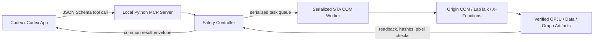

# Origin COM Automation

[English](README.md) | [简体中文](README.zh-CN.md)

<!-- section:overview -->
## 项目简介

Origin COM Automation 是一个在 64 位 Windows 上运行的个人 Codex 插件。它通过本地
Python MCP Server 调用 OriginLab 提供的 COM、LabTalk 和 X-Function 接口，让 Codex
能够在后台检查 Origin 项目、连接数据源、读写表格、执行分析、绘图、导出结果并验证产物。

通俗地说，这个插件的作用不是“替你在 Origin 界面上乱点鼠标”，而是让 Codex 直接调用
Origin 自己的自动化接口。你可以用自然语言描述任务，插件负责把任务转换成结构化工具调用，
并尽量把关键计算留在 Origin 项目内部，方便之后打开 OPJU 查看、修改和重新计算。

默认行为强调可编辑和可追溯：

- CSV、TSV 和 Excel 数据默认继续连接源文件；
- 计算列默认保存为 Origin 表格中的 `F(x)` 公式；
- 已验证的拟合默认创建 Origin 原生 Analysis Operation；
- 原始 OPJU 默认不覆盖，先建立工作副本；
- 写入、保存和导出不能仅凭“没有报错”就宣称成功，必须回读或检查产物。

典型用途包括：

- 把 CSV 或 Excel 数据自动整理成可编辑的 Origin 项目和论文图；
- 修改已有 OPJU 的副本，同时保留原始项目；
- 审计项目中真实的工作簿、图页、图层、数据列和绘图数据源；
- 使用 Origin 原生线性拟合，或者显式选择 Python 兼容分析；
- 管理 Matrix、Image Page、Project Folder 和 Notes；
- 导出 PNG、TIFF、PDF 或 SVG，并检查图片是否为空、尺寸是否合理；
- 使用 FigureSpec 描述一整套任务，或串行执行批量任务。

版本验证记录见 [0.2.0 验证报告](docs/VALIDATION-0.2.0.md)和
[0.2.1 验证报告](docs/VALIDATION-0.2.1.md)。

<!-- section:requirements -->
## 运行环境

- 64 位 Windows
- Origin 2024，或提供兼容 COM Server 的 Origin 版本
- 64 位 Python 3.11 或更高版本
- 已注册的 `Origin.Application`、`Origin.ApplicationCOMSI` 或 `Origin.ApplicationSI`
- 支持本地插件和 MCP 的 Codex

目前完整实机验证环境是 Windows 11 x64、Python 3.13 x64 和 Origin `10.1.0.178` x64。
其他 Origin 版本可能可以运行，但涉及特定 X-Function、模板、图形或分析操作时，在完成对应版本
的真实回读验证以前，只能标记为“支持但未验证”。

安装脚本会在插件目录中创建独立的 `.venv`，不会把依赖安装到系统 Python。主要依赖包括
pywin32、MCP、Pydantic、NumPy/SciPy、OpenPyXL、Pillow、psutil、pandas 和 xlrd。

<!-- section:setup -->
## 安装方法

克隆或下载仓库，在仓库根目录打开 PowerShell，执行：

```powershell
& '.\scripts\bootstrap.ps1'
& '.\scripts\diagnose.ps1'
```

`.mcp.json` 使用相对路径调用插件目录中的 Python，因此源代码目录和 `.venv` 可以整体移动。
然后把插件安装或更新到个人 Codex marketplace：

```powershell
codex plugin add origin-com-automation@personal
```

安装完成后请新建一个 Codex 任务。已经打开的任务会继续使用创建时加载的旧工具 Schema，
不会自动切换到新的 cachebuster 版本。

<!-- section:quick-start -->
## 快速使用

最简单的方式是在 Codex 中直接描述任务。建议一次说清楚数据文件、工作表、X/Y 列、数据范围或
扫描分支、分析方法、图形类型和输出路径。例如：

```text
请在后台启动 Origin。把 transfer.xlsx 的 Data 工作表作为连接数据导入，使用 A/B 列，
创建可自动重算的 Origin 原生线性拟合，绘制散点图和拟合结果，另存为新的 OPJU，导出 PNG，
并验证行数、数据绑定、拟合 Operation 和图片。不要覆盖源文件。
```

修改已有项目时可以这样说：

```text
打开 device.opju 的工作副本，先审计实际工作簿、图页和绘图数据源，只修改指定图页，
保持图形直接绑定原表，另存为 device-reviewed.opju 并导出。不要覆盖原项目。
```

一个健康的新数据任务通常只走下面这条关键路径：

1. `origin_health_check` 检查环境；
2. `origin_start` 创建插件自有的后台 Origin；
3. `origin_import_data`，默认使用 `source_mode="linked"`；
4. 只回读决定结果的 X/Y 列，确认数量和内容；
5. 调用 `origin_set_column_formula` 和/或 `origin_run_analysis`；
6. 调用 `origin_create_plot`，再用一次 `origin_configure_graph` 完成主要配置；
7. `origin_save_project_copy` 和 `origin_export_graph`；
8. 验证文件、图源和分析对象，最后 `origin_shutdown`。

<!-- section:session-modes -->
## Origin 会话模式

- **自有会话（默认）：** 使用 `Origin.Application` 和新的 `DispatchEx` COM 代理启动独立实例。
  只有所有权安全门通过后，才允许修改、保存和退出。
- **附加会话：** 显式连接已经运行的 `Origin.ApplicationSI` 或
  `Origin.ApplicationCOMSI`。它始终属于用户并且只读，插件不会改变可见性，也不会调用 `Exit`。
- **独占附加：** `exclusive=true` 只表示向 SI/COMSI 请求 Session Lock，仍然是只读，
  不能因为获得锁就把它当作插件自有进程。

Origin COM 没有提供可靠的“COM 代理对应哪个 PID”接口。因此进程 PID 只能作为审计证据，
不能作为结束进程的授权。插件不会因为启动前后多出一个 PID 就强制杀死 Origin。

<!-- section:tool-surface -->
## 工具总览

MCP Server 共暴露 45 个结构化工具。对于专业图形、分析或对象操作，可以先调用
`origin_capabilities`，查看当前 Origin 版本下该能力属于 `verified`（已验证）、
`supported_unverified`（支持但未完整验证）还是 `unsupported`（不支持）。

| 分类 | 工具 |
|---|---|
| 环境检查 | `origin_health_check`、`origin_capabilities`、`origin_inspect_data_source`、`origin_query_knowledge` |
| 会话控制 | `origin_start`、`origin_recover_session`、`origin_shutdown` |
| 项目管理 | `origin_open_project`、`origin_save_project_copy`、`origin_save_and_replace_source`、`origin_close_project`、`origin_list_objects` |
| 表格数据 | `origin_import_data`、`origin_read_worksheet`、`origin_write_worksheet`、`origin_transform_worksheet`、`origin_set_column_formula`、`origin_manage_connector` |
| Origin 对象 | `origin_manage_matrix`、`origin_manage_image`、`origin_manage_project_folder`、`origin_manage_note` |
| 数据分析 | `origin_run_analysis`、`origin_run_xfunction`、`origin_list_analysis_operations`、`origin_get_analysis_operation`、`origin_recalculate_analysis`、`origin_manage_analysis_template`、`origin_execute_labtalk` |
| 图形 | `origin_graph_catalog`、`origin_palette_catalog`、`origin_list_graph_templates`、`origin_create_plot`、`origin_create_graph`、`origin_configure_graph`、`origin_manage_graph_layout`、`origin_apply_graph_template` |
| 导出和图像验证 | `origin_export_graph`、`origin_view_graph`、`origin_inspect_png` |
| 高级工作流 | `origin_plan_figure`、`origin_execute_figure`、`origin_submit_batch`、`origin_task_status`、`origin_cancel_task` |

所有工具返回统一结构：

```text
success, data, warnings, error_code, error_message,
artifacts, duration_ms, origin_version
```

涉及修改的工具必须运行在插件自有会话中。如果 Origin 拒绝命令、回读不一致、对象引用失效，
或者无法验证保存和导出文件，工具会明确失败，不会用 `success=true` 掩盖不确定状态。

<!-- section:critical-path -->
## 高效关键路径

Skill 会先判断任务属于哪条路线，再调用工具，避免健康任务反复进入诊断和试错流程。

### 环境诊断

只运行一次 `origin_health_check`。只有 COM 注册、Python/Origin 位数、权限和依赖兼容时才进入
COM 会话。正常执行过程中不反复做完整诊断。

### 从新数据创建项目

先在 Origin 外部只读检查文件结构，再启动自有 Origin，创建干净工作簿并添加 Data Connector。
导入后首先检查决定结果的 X/Y 列。如果关键列为空或与源数据不一致，立即停止，不继续创建空图。

### 修改已有 OPJU

先复制再打开，只做一次对象审计，通过稳定名称或对象引用定位目标，仅执行用户要求的修改，
保存为新文件。涉及持久化时重新打开候选项目验证。源 OPJU 在整个会话中都受保护。

### 查看或导出用户当前打开的 Origin

必须显式使用 SI/COMSI 只读附加。可以列对象、定向读取、预览和导出，但不能修改项目，也不能
关闭用户的 Origin。

流程会复用成功返回、合并相邻范围、多 Y 列一次传入。对象引用失效后最多重新审计一次；
写入、分析、保存、导出、超时和 RPC 失败绝不盲目重试。

<!-- section:linked-data -->
## 源文件连接与可编辑计算列

CSV、TSV、XLS、XLSX 和 XLSM 默认使用 `source_mode="linked"`。插件不是把源数据简单复制进
Origin 后就断开关系，而是建立本地 Data Connector。导入返回会验证规范化源路径、源文件哈希、
连接状态、Excel 工作表选择、表头策略、行列数、列标签，以及数值/文本/缺失值数量。

对于 Excel，一行表头通过 Origin 的列 Long Name 配置实现，不能把第一条真实数据误当成第二行
表头吞掉。指定非首个工作表时，插件会把选择写入 Connector，并在导入后回读确认。

用户自定义的 Origin 表格模板可能保存旧长名称、格式、行数或连接器。新建工作簿时，插件会从
Origin 安装目录中的只读系统模板开始，清除继承的名称，再建立新连接；不会修改用户自己的模板。

只有确实需要静态副本时才使用 `source_mode="snapshot"`。Snapshot 路线能处理混合数值/文本列，
并对每一列执行源数据与 Origin 回读比较。

`origin_write_worksheet` 会检查 COM 返回值、触发待处理的自动重计算，并立即回读写入矩形。
如果无法证明写入成功，就返回失败而不是“假成功”。

派生列默认使用 `origin_set_column_formula`。它把公式保存在 Origin 的 `F(x)` 中，并验证 Formula、
Before Formula Script、FormulaRange、`SVRM` 和代表性计算值。目标是紧邻当前数据的下一列时，
可以自动追加。只有显式选择 materialized 兼容模式时，才把外部计算值静态写入表格。

<!-- section:native-analysis -->
## Origin 原生分析

`origin_run_analysis` 默认使用 `backend="origin_native"`、`create_operation=true` 和
`recalculate_mode="auto"`。目前经过实机完整验证的线性拟合会调用 Origin 自己的 `fitlr`，
创建原生 Analysis Operation，解析动态输出范围，并返回稳定 Operation 引用。源数据变化后，
该操作可以在 Origin 中查看、修改和重算。

如果某个方法或参数没有加入已验证原生注册表，插件会列出可用原生方法并失败。它不会偷偷改用
NumPy/SciPy 分析，也不会把外部结果粘贴回表格后冒充 Origin 原生分析。

`backend="python"` 是显式兼容选择，用于更广的结构化分析目录，例如描述统计、多项式拟合、
平滑、导数、峰分析、FFT、统计检验和已实现的非线性模型。返回会明确标记
`editable_in_origin=false` 和 `native_operation_created=false`。

插件不会擅自替换拟合分支、行范围、筛选条件、导数方法、平滑窗口、多项式次数、缺失值策略或
归一化方式。行号范围是包含首尾的 0-based；多个 filters 使用 AND；`row_order` 只能是
`as_is` 或 `reverse`。

`origin_run_xfunction` 提供带白名单和类型验证的结构化 X-Function 入口。范围、文件、输出引用和
函数名都会验证。Analysis Template 和通用 X-Function 仍受能力目录约束，只有完成对应版本的
真实结果验证后才能标记为已验证。

<!-- section:architecture -->
## 系统架构



整个控制链在本机运行，工作表数据和 Origin 项目不需要上传到远程分析服务。Codex 通过 stdio
与 MCP Server 通信；Server 验证 JSON 参数后调用单一 Controller；Controller 负责会话所有权、
源文件保护、对象引用、超时、错误分类和回读；真正的 COM 调用集中到一个长期存在的 STA 线程。

这样设计是因为 pywin32 的 COM 代理受到 Apartment 线程模型约束。把 Origin COM 对象随意交给
多个请求线程，容易造成 RPC 断开、对象失效或无法正确释放。STA Worker 在自己的线程中完成 COM
初始化和释放，并通过串行队列依次执行任务。

<!-- section:implementation -->
## 功能实现细节

### MCP Schema 层

`src/origin_com_automation/server.py` 定义严格的 FastMCP 工具。Pydantic Schema 会展开枚举、
图形配置、FigureSpec、筛选器、覆盖策略和 Connector 选项。未声明字段会被拒绝，避免拼错参数后
静默使用默认值。

### Controller 和安全状态

`com/origin_api.py` 负责协调项目、表格、分析、图形和文件。它记录会话是 owned、attached、
exclusive、timeout 还是 poisoned，维护受保护源项目列表，并把异常转换成稳定错误码。MCP 请求
进入 STA 队列前还有全局串行化，防止两个任务交错修改同一个 Origin 实例。

### 原生命令规划器

`native/` 会验证 LabTalk 标识符、路径、Range、X-Function 名称、公式、输出引用和重算模式，
然后才生成命令。包含长名称的工作表引用会按 LabTalk 规则加引号，但对外返回的稳定引用不变。
原生注册表是白名单，不是任意命令注入入口。

### Origin 对象模块

`objects/` 为 Data Connector、表格变换、Matrix、Image Page、Project Folder 和 Notes 构建经过
验证的计划。图形目录、布局、模板、配色和预览逻辑位于 `graphs/`。文件预检和 Python 兼容分析
放在独立 services 中，因此不会把 COM 对象泄漏到其他线程。

### 为什么“没有异常”不等于成功

COM 方法不报错只能说明调用返回，不能证明结果正确。导入会比较源列和目标列统计；写入会回读
单元格；保存会检查文件、大小和项目状态，必要时重新打开；导出会检查实际文件；图形预览会解码
像素；Analysis Operation 创建后还要查询。无法证明任务关键条件时就返回失败。

### 超时和恢复

幂等读取在已知 RPC busy/unavailable 情况下最多重试一次，修改操作不重试。发生 `COM_TIMEOUT`
后，原 Worker 被视为不再可靠。`origin_recover_session` 不会再向阻塞线程排队一个普通 60 秒关闭，
而是退役旧 Controller、返回进程审计状态，并为后续 `origin_start` 提供新的控制面。

### 日志

结构化日志记录 task ID、阶段、耗时、Origin 版本、项目路径、对象名称、警告和错误码，不记录
工作表具体数值或其他敏感实验数据。

<!-- section:figurespec-batch -->
## FigureSpec、批量任务与图形

`origin_plan_figure` 在不修改 Origin 的情况下验证严格 FigureSpec，返回 SHA-256 digest、执行阶段、
解析路径、阻塞项、警告和能力状态。执行时必须提交同一个 digest，因此修改数据模式、分析方法或
危险选项会形成新的计划，不能沿用旧审批。

两条高级路线是：

- `data_to_project`：检查/导入、分析、绘图、保存、导出、QA 和退出；
- `restyle_project`：打开工作副本、更新指定图形、另存、导出、QA 和退出。

FigureSpec 输入默认是连接数据，分析默认是可自动重算的 Origin 原生 Operation。
`origin_submit_batch` 按顺序串行执行多个 FigureSpec；状态只暴露阶段和进度，不暴露工作表数值。
只有排队中或两个安全任务之间可以取消，COM 修改执行到一半时不会假装已经取消。

图形工具已验证散点图、折线图和柱状图，并为误差棒、热图、等高线、极坐标、三元图和 3D 图提供
能力受控入口。布局管理覆盖图层、插图、双 Y 轴和多面板命令路线。模板必须先发现再显式选择。
预览工具会导出临时图片，并返回尺寸、非空像素和颜色指标，供视觉 QA 使用。

<!-- section:examples -->
## MCP 调用示例

```json
{"tool":"origin_start","arguments":{"visible":false,"attach":false}}
{"tool":"origin_import_data","arguments":{"file_path":"C:\\data\\transfer.xlsx","worksheet_name":"Transfer","sheet_name":"Data","has_header":true,"target_mode":"new_workbook"}}
{"tool":"origin_set_column_formula","arguments":{"worksheet_ref":"[Transfer]Sheet1","column":"C","formula":"col(A)*col(B)","recalculate_mode":"auto"}}
{"tool":"origin_run_analysis","arguments":{"worksheet_name":"[Transfer]Sheet1","method":"linear_fit","x_column":"A","y_column":"B"}}
{"tool":"origin_create_plot","arguments":{"worksheet_name":"[Transfer]Sheet1","graph_type":"scatter","x_column":"A","y_columns":["B"],"graph_name":"TransferGraph"}}
{"tool":"origin_export_graph","arguments":{"graph_name":"[TransferGraph]1","output_path":"C:\\results\\transfer.png","export_format":"png","overwrite":"skip"}}
{"tool":"origin_save_project_copy","arguments":{"target_path":"C:\\results\\transfer.opju"}}
{"tool":"origin_shutdown","arguments":{}}
```

显式 Python 兼容分析示例：

```json
{"tool":"origin_run_analysis","arguments":{"worksheet_name":"[Transfer]Sheet1","method":"derivative","x_column":"A","y_column":"B","row_start":120,"row_end":240,"row_order":"reverse","filters":[{"column":"y","operator":"gt","value":0}],"options":{"backend":"python","order":1,"derivative_method":"central","create_operation":false,"recalculate_mode":"none"}}}
```

<!-- section:safety -->
## 安全机制和失败处理

- 源 OPJU 打开前先复制，并在整个会话中保持受保护；
- 普通保存不能覆盖受保护源项目；
- 替换源项目需要双重显式允许、预期 SHA-256、候选文件保存/重开验证、再次检查源哈希，默认保留备份；
- 已存在输出必须显式选择 `skip`、`rename` 或 `replace`；
- 附加的 SI/COMSI 会话始终只读，插件不会关闭；
- 只有插件自有 COM 代理对应的 owned 会话才允许调用安全退出；
- PID 观察不能单独授权强制结束进程；
- 可能终止隐藏 Origin 的计划任务只报告，未经授权不禁用、不删除；
- 文件锁、路径不存在、权限、RPC 断开、Server 启动失败和超时尽量返回不同错误码；
- LabTalk 和 X-Function 参数先通过受限验证，原始 LabTalk 是单独的显式工具；
- 日志不记录实验数据和工作表数值。

<!-- section:diagnostics -->
## 故障诊断

执行：

```powershell
& '.\scripts\diagnose.ps1'
```

`origin_health_check` 会检查 Python/Origin 位数、依赖、已注册 ProgID、Origin 可执行文件权限、
临时目录写权限、正在运行的 Origin 和类似 watchdog 的计划任务。健康检查本身不会激活 COM。

出现 `CO_E_SERVER_EXEC_FAILURE` 时，优先检查两个注册表视图、Python/Origin 是否同为 64 位、
是否已有 Origin 实例，以及清理/watchdog 任务。会话超时或中毒后使用
`origin_recover_session`，不要再发起一次普通关闭并额外等待 60 秒。

stdio Server 只把协议数据写入 stdout，Python 日志和诊断写入 stderr，避免破坏 MCP 协议。

<!-- section:tests -->
## 测试与验证

```powershell
& '.\.venv\Scripts\python.exe' -m pytest tests\unit -q -p no:faulthandler
& '.\.venv\Scripts\python.exe' -m ruff check .
& '.\.venv\Scripts\python.exe' -m mypy
& '.\.venv\Scripts\python.exe' -m build
& '.\.venv\Scripts\python.exe' -m pip check
& '.\.venv\Scripts\python.exe' scripts\release_audit.py .
& '.\.venv\Scripts\python.exe' scripts\validate_distribution.py .
& '.\scripts\smoke_test.ps1' -Live
```

单元测试使用模拟 COM 对象，不要求安装 Origin。实机 smoke test 必须显式开启，只创建插件自有
`Origin.Application`，并保护测试开始前已经存在的 Origin 进程。当前覆盖连接 CSV/Excel、混合
数据、表格写入回读、`F(x)`、原生 `fitlr`、保存重开、Matrix、Image Page、Notes、Project Folder、
图形像素预览、FigureSpec 和批量执行。

WSe2 反馈回归需要通过 `ORIGIN_FEEDBACK_PROJECT` 提供单独的 OPJU fixture，而且始终在临时副本上运行。

<!-- section:update-uninstall -->
## 更新与卸载

修改插件后，使用官方 helper 更新 Codex cachebuster，再重新安装：

```powershell
& '.\.venv\Scripts\python.exe' "$HOME\.codex\skills\.system\plugin-creator\scripts\update_plugin_cachebuster.py" .
codex plugin add origin-com-automation@personal
```

更新后需要新建 Codex 任务。只删除安装缓存和注册、不删除源代码仓库时执行：

```powershell
codex plugin remove origin-com-automation@personal
```

<!-- section:scope-limits -->
## 已验证范围与已知限制

已在 Origin `10.1.0.178` 验证：owned 生命周期、只读附加、本地 CSV/Excel 连接导入、混合 Excel
snapshot、表格写入回读、持久化 Origin 公式、原生线性拟合 Operation 重算、OPJU 保存重开、本地
Connector 刷新、Matrix 读写持久化、PNG Image Page 导入、Notes、Project Folder 创建/列出/重命名、
散点/折线/柱状图、分类样式和图例、图形像素预览、FigureSpec 和双任务串行批处理。

支持但尚未覆盖全部选项实机验证：通用白名单 X-Function、Analysis Template、Matrix 变换、
Image Page 导出/转换、Folder 移动/删除、图形模板应用、完整双 Y/插图绑定和专业 2D/3D/统计图。
不能因为 Origin 命令没有抛异常就把这些能力宣称为已验证。

不支持：需要认证的远程 Connector、把 PID 差异当作 COM 所有权证明，以及仅凭观察到的 PID
强制结束 Origin。

<!-- section:disclaimer -->
## 免责声明

本项目是独立开源项目，**与 OriginLab 不存在隶属、授权或背书关系**。Origin、OriginPro、
LabTalk 和 X-Function 是 OriginLab Corporation 的产品或技术名称，相关名称和商标归各自权利人所有。

本插件属于科研自动化软件，不构成科学、工程、法律、监管或商业建议。用户需要自行负责选择和
记录分析方法、扫描分支、数据范围、筛选规则、单位、模型、约束、源数据、模板、许可证和最终解释。
在用于论文、决策、器件制备、测试或其他重要工作前，请务必**备份重要项目和源数据**，并人工
**复核并验证输出**。

COM 自动化、LabTalk、X-Function、Origin 模板、第三方文件、计划清理任务以及 Origin 版本差异
都可能改变行为或造成结果不完整。插件的安全检查可以降低常见风险，但不能保证所有结果绝对正确、
所有版本完全兼容、任务不中断，或任何 Origin/Windows 故障都能恢复。

本软件依据 [MIT License](LICENSE) 提供，不附带任何形式的保证。完整授权条件和责任限制以
LICENSE 文件为准。

<!-- section:references -->
## 参考与归属

参见 [References and Attribution](docs/REFERENCES.md)，其中记录了设计阶段参考的公开项目、
许可证，以及“架构启发”和本仓库独立实现之间的边界。

版本历史和验证证据：

- [Origin COM Automation 0.2.0 验证报告](docs/VALIDATION-0.2.0.md)
- [Origin COM Automation 0.2.1 验证报告](docs/VALIDATION-0.2.1.md)
