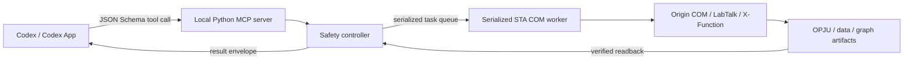

# Origin COM Automation Architecture

This document describes the local runtime, safety controller, Origin execution boundary, and source
modules behind the user-facing plugin. The short version is: Codex sends a validated request, one
serialized STA worker controls Origin, and the controller returns verified artifact readback.

## System Flow



The public boundary is a strict JSON Schema tool call. The execution boundary is a serialized STA
queue. Origin COM, LabTalk, and X-Function work stays on that worker. The return boundary is a
verified artifact or object readback, not merely the absence of an exception.

All project files and worksheet values remain local to the Windows machine. The server uses stdio
to communicate with Codex; it does not require a remote analysis service.

## Runtime And Launch

The plugin manifest points to `.mcp.json`, which launches `scripts/run_mcp.ps1`. That launcher
resolves the installed plugin version and starts a version-scoped runtime at:

```text
%LOCALAPPDATA%\OriginComAutomation\runtime\<plugin-version>
```

`scripts/bootstrap.ps1` creates that runtime under a lock so concurrent Codex launches cannot
publish a partial environment. It does not install packages into system Python and does not import
a repository-local `.venv`. The runtime contains the package and its pinned/limited dependencies,
including pywin32, MCP, Pydantic, NumPy/SciPy, OpenPyXL, pandas, Pillow, psutil, and xlrd.

`scripts/runtime_path.ps1` provides the shared path calculation. `scripts/diagnose.ps1` checks
bitness, dependencies, registration, executable access, temporary-directory access, active Origin
processes, and watchdog-like tasks. `scripts/run_server.ps1` is the direct server launcher used by
the MCP wrapper.

The stdio process writes protocol messages only to stdout. Logs and diagnostics go to stderr so
they cannot corrupt the MCP message stream.

## Server And Strict Schemas

`src/origin_com_automation/server.py` constructs 45 FastMCP tools. Each tool uses a Pydantic-backed
argument model with `extra="forbid"`, so unknown arguments fail instead of being silently ignored.
Structured models cover filters, worksheet transforms, graph options, native parameters,
overwrite policies, and FigureSpec plans.

Tool responses normally use `ResultEnvelope` from `contracts.py`:

```text
success, data, warnings, error_code, error_message,
artifacts, duration_ms, origin_version
```

Stable error codes distinguish source/path errors, ownership rejection, invalid plans, stale refs,
RPC failures, timeout, and failed verification where Windows and Origin expose enough evidence.
The [Tool Reference](TOOL-REFERENCE.md) lists the complete public surface.

## Controller And Ownership State

`com/origin_api.py` is the primary controller. It coordinates sessions, projects, worksheets,
analyses, graphs, exports, and native objects while tracking whether the current session is owned,
attached, exclusive, timed out, or poisoned. It also records protected project sources and converts
lower-level exceptions to result envelopes.

There are three session modes:

- **Owned (default):** a fresh `Origin.Application` proxy is created with `DispatchEx`. Mutation,
  saving, and shutdown are allowed only after ownership gates succeed.
- **Attached:** an active `Origin.ApplicationSI` or `Origin.ApplicationCOMSI` session is explicitly
  attached as user-owned and read-only. The plugin does not change visibility or call `Exit`.
- **Exclusive attachment:** `exclusive=true` requests the Origin session lock exposed by SI/COMSI.
  It remains read-only and is never reclassified as owned.

Origin COM does not expose a reliable proxy-to-PID binding. Process observations are audit evidence,
not authority to mutate, close, or terminate a process. A PID that appears during activation does
not by itself prove that the COM proxy owns that process.

A global operation lock sits in front of the worker so concurrent MCP requests cannot interleave
Origin mutations. Ownership checks, source protection, and timeout/poison state are evaluated at the
controller boundary.

## Serialized STA Worker

`com/worker.py` owns one long-lived single-threaded-apartment worker. It initializes COM inside the
worker thread, creates and releases pywin32 proxies there, and executes controller work from a serial
queue. No Origin proxy is intentionally passed to arbitrary MCP request threads.

This boundary matters because pywin32 COM proxies are apartment-affine. Cross-thread proxy use can
produce RPC disconnects, stale proxies, undefined cleanup, and out-of-order mutation. Serializing
work also makes project-state transitions and readback checkpoints deterministic.

`com/session.py` handles activation, attachment, ownership state, and shutdown behavior.
`com/discovery.py` inspects registration and executable candidates. `com/errors.py` normalizes
well-known COM/Windows failures. Support modules isolate worksheet, graph, and project-specific COM
operations.

## Data And Object Modules

The implementation separates validation/planning from stateful COM execution:

| Area | Modules | Responsibility |
|---|---|---|
| Worksheet/data | `objects/worksheets.py`, `objects/connectors.py`, `services/worksheets.py`, `data_inspection.py` | Inspect local sources, plan worksheet operations, manage local connectors, and verify reads/writes. |
| Project objects | `objects/project.py`, `objects/matrices.py`, `objects/images.py`, `services/projects.py` | Validate and execute Project Folder, Notes, Matrix, Image Page, and project operations. |
| Native commands | `native/common.py`, `native/formulas.py`, `native/operations.py`, `native/xfunctions.py` | Validate identifiers, formulas, ranges, paths, native method mappings, parameters, outputs, and recalculation modes. |
| Analysis | `services/analysis.py` | Route verified Origin-native analysis or explicit Python compatibility methods and package results. |
| Graphs | `graphs/catalog.py`, `graphs/layout.py`, `graphs/templates.py`, `graphs/palettes.py`, `graphs/preview.py`, `services/graphs.py` | Define graph roles/capabilities, layout commands, digest-locked templates, palettes, export, and pixel QA. |
| Workflow | `workflows/figurespec.py`, `workflows/executor.py`, `workflows/batch.py`, `workflows/tasks.py` | Preflight immutable plans and execute approved figure or batch work serially. |

The `objects/validation.py` helpers keep stable refs, paths, names, and ranges constrained before a
command reaches Origin. File inspection and Python compatibility analysis do not hold COM objects.

## Linked Data And Editable Columns

CSV, TSV, XLS, XLSX, and XLSM imports default to `source_mode="linked"`. Origin receives a local
Data Connector rather than only a copied block of values. Import verification records the canonical
source path, source hash, connector state, selected Excel sheet, header policy, row/column counts,
labels, and numeric/text/missing profiles.

Explicit one-row Excel headers use Origin's long-name label configuration so the first data row is
not consumed as a second header. A requested non-first sheet is passed to the connector and read
back. New workbooks start from the read-only system worksheet template, clear inherited names, and
then add the requested connector without modifying the user's default template.

`source_mode="snapshot"` is the explicit disconnected route. It uses mixed-value-aware formats and
compares each source column with immediate Origin readback.

`origin_write_worksheet` checks the COM return, flushes pending automatic recalculation, and reads
the written rectangle back. `origin_set_column_formula` instead preserves an Origin `F(x)` formula,
Before Formula Script, FormulaRange, `SVRM`, and representative calculated values. The immediately
next worksheet column may be appended.

## Native Analysis

`origin_run_analysis` defaults to `backend="origin_native"`, `create_operation=true`, and
`recalculate_mode="auto"`. The verified linear-fit mapping runs Origin `fitlr`, creates a native
Analysis Operation, resolves dynamic output refs, and returns a stable operation ref for listing,
inspection, and recalculation.

The native registry is an allowlist. If a requested method/option mapping is not verified, the call
fails with available methods instead of silently running NumPy/SciPy or pasting an external result.
`origin_run_xfunction` likewise accepts a validated X-Function name, typed parameters, declared
outputs, and a capability opt-in for supported-but-unverified routes. Raw LabTalk remains a separate
explicit tool.

`backend="python"` is a compatibility route for the supported structured catalog. It labels results
`editable_in_origin=false` and `native_operation_created=false`. Neither route changes a requested
branch, inclusive row range, filters, row order, derivative method, smoothing window, polynomial
degree, normalization, model, or constraint.

## Graph Creation And QA

The graph catalog maps graph families to exact data roles and a verification state. Verified basic
routes cover scatter, line, and column graphs. Capability-gated routes expose error bars, heatmaps,
contours, polar, ternary, 3D, multi-layer, inset, dual-Y, and multi-panel operations without claiming
that every Origin version or option combination is verified.

Template discovery is restricted to caller-supplied roots. Applying a template requires its expected
SHA-256 and checks layer compatibility. Palettes are plugin-owned data with explicit colors and usage
restrictions.

`origin_view_graph` exports a temporary PNG, decodes it, and returns dimensions, alpha/content bounds,
nonblank pixels, and optional expected-color metrics. `origin_export_graph` checks the actual output
artifact under an explicit overwrite policy. These checks detect common blank/missing output but do
not replace scientific or visual review.

## FigureSpec And Batch Workflows

`origin_plan_figure` validates a strict FigureSpec without mutating Origin. It returns an immutable
SHA-256 digest, stages, resolved paths, blockers, warnings, and capability states. Execution requires
the same digest; changing a data mode, analysis method, or destructive option requires a new plan.

Two high-level routes are defined:

- `data_to_project`: inspect/import, analyze, plot, save, export, QA, and shut down.
- `restyle_project`: open a protected working copy, update a named graph, save separately, export,
  QA, and shut down.

`origin_submit_batch` runs approved FigureSpecs one at a time. Task status exposes stages and
progress but not worksheet values. Cancellation is accepted while queued or between safe items,
never in the middle of a COM mutation. A failed item follows the explicit `stop` or `continue`
policy; no item is blindly replayed.

## Source And Output Safety

- OPJU sources are copied before opening and remain protected for the session.
- Ordinary saves cannot overwrite a protected source.
- Source replacement requires dual opt-in, the expected source SHA-256, candidate save/reopen
  validation, a second source hash check, and a backup by default.
- Existing outputs use explicit `skip`, `rename`, or `replace` behavior where supported.
- Attached sessions are read-only and are never closed by the plugin.
- Only an owned session may be shut down through its owned COM proxy.
- PID observations never authorize force termination.
- Watchdog-like scheduled tasks are reported but never disabled or deleted automatically.
- LabTalk and X-Function inputs pass restricted validation; raw LabTalk stays explicitly advanced.
- Logs omit worksheet values and experimental datasets.

## Verification Model

A COM method returning without an exception is not success by itself. The controller checks the
invariant appropriate to each operation:

| Operation | Verification |
|---|---|
| Import | Compare source and destination shape, labels, profiles, source path, and connector state. |
| Worksheet write | Read the written rectangle back after pending recalculation. |
| Formula | Read back formula metadata, range/recalculation state, and representative values. |
| Native analysis | Query the created Analysis Operation and its resolved outputs. |
| Save | Check path, file state/size, current project state, and reopen persistence where required. |
| Graph | Read bindings and/or inspect a rendered preview. |
| Export | Check the actual file and format-specific evidence available to the exporter. |

Verification is bounded around defining data and artifacts. Healthy work reuses successful results,
batches contiguous reads, and allows one refreshed object audit after a stale ref rather than
repeating full discovery after every step.

## Timeouts, Retries, And Recovery

Idempotent reads may retry once for known transient RPC busy/unavailable errors. Mutations, analyses,
saves, and exports are not blindly replayed because the first call may have partially completed.

After `COM_TIMEOUT`, the worker is poisoned for future calls. `origin_recover_session` abandons the
old controller without queueing another ordinary shutdown on its blocked STA thread, returns the
owned-process audit state, and installs a fresh controller for a later `origin_start`. Recovery does
not claim whether an interrupted scientific mutation committed; the user must inspect resulting
state before deciding what to do.

## Logging And Privacy

Structured logs record task ID, stage, duration, Origin version, project path, object names,
warnings, and error codes. They do not record worksheet cell values or other experimental datasets.
Artifact paths can still be sensitive and should be handled according to the user's local data
policy.

## Source Layout

```text
src/origin_com_automation/
  server.py              MCP tool registration and strict public schemas
  contracts.py           result envelopes and shared request models
  config.py              runtime configuration
  com/                    STA worker, activation, controller, COM support
  native/                 validated formulas, operations, and X-Functions
  objects/                worksheet, connector, Matrix, Image, project plans
  graphs/                 catalogs, layouts, templates, palettes, previews
  services/               data/analysis/graph/project orchestration
  workflows/              FigureSpec planning, execution, batching, tasks
  resources/              local capability knowledge
```

Unit tests use fake COM objects and do not require Origin. Live smoke tests are opt-in, create only
plugin-owned `Origin.Application` instances, and preserve Origin processes that existed before the
test. Release-specific commands and exact pass/fail evidence belong in the corresponding validation
record rather than this architecture document.
