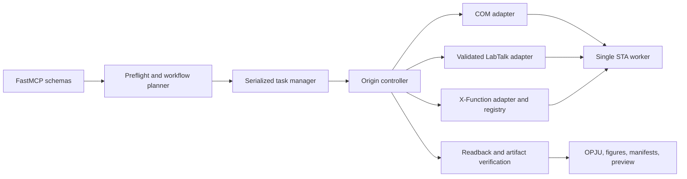

# Origin COM Automation v0.2 Expansion Design

Status: review requested

Target: local plugin release `0.2.0`
Primary verified environment: Windows 11 x64, Origin 10.1.0.178, Python x64

## 1. Purpose

Version 0.2 expands the current safe background COM plugin into a broader Origin automation
surface without replacing its ownership, source-protection, STA serialization, readback, or
timeout-recovery guarantees.

The design is informed by the public interfaces and workflow ideas in:

- `Ge-Shun/origin-mcp` (MIT): tool profiles, FigureSpec, Origin-native analysis, broad object
  coverage, graph preview, templates, batch workflows, and knowledge discovery.
- `hang-jin/editaplot` (Apache-2.0): data-first planning, explicit scientific semantics,
  verified output bundles, template/palette discipline, pixel checks, and fail-closed release
  auditing.

No source code, templates, images, palettes, or branded assets will be copied. New code will be
implemented against this plugin's existing COM/LabTalk architecture and Origin behavior observed
in local tests. A references document will record architectural inspiration and licenses.

## 2. Success Criteria

1. Common work completes through one preflight call and one high-level execution call, with
   optional task-status polling for long operations.
2. Existing low-level tools remain compatible and available for exact control and diagnostics.
3. Every mutation runs on the owned STA session and stops at the first unconfirmed write,
   analysis, save, or export.
4. Scientific choices such as fit function, branch, range, filter, smoothing, derivative method,
   normalization, or missing-value policy are never inferred silently.
5. New graph, matrix, image, connector, project-organization, and analysis features have strict
   schemas, stable object references, unit tests, MCP transport tests, and representative live
   Origin smoke tests.
6. A high-level completed workflow returns an editable OPJU when requested, exported figures,
   source and artifact hashes, verification reports, Origin version, stable object references,
   and confirmed owned-session shutdown state.
7. The local version is installed and verified before any GitHub push. Specialized features that
   cannot be exercised on Origin 10.1 are reported as unverified rather than claimed successful.

## 3. Non-Negotiable Safety Invariants

- Direct COM plus LabTalk remains the default backend. An embedded Origin bridge is not added as
  the default or as a hidden dependency.
- All COM proxies stay on one serialized STA worker. Background tasks enqueue work; they do not
  create parallel COM access.
- Attached SI/COMSI sessions remain read-only. All new mutation tools require an owned instance.
- Source OPJU files remain protected. New workflows save to a separate output unless the existing
  high-risk source-replacement gate is explicitly satisfied.
- The plugin never force-terminates a PID without an independently proven ownership mechanism.
- A timed-out mutation is never replayed automatically. The poisoned controller is recovered
  before a new session starts.
- User workbook templates are not used implicitly for new-data import. Graph templates are a
  separate, explicit opt-in capability.
- Raw LabTalk remains available only through the existing explicit tool. New structured tools
  escape identifiers, paths, strings, and range expressions before generating LabTalk.

## 4. Architecture

The current `origin_api.py` will be reduced incrementally. Public controller methods remain stable
while implementation moves into bounded modules:

- `native/xfunctions.py`: X-Function discovery, typed parameters, command generation, results.
- `native/operations.py`: Analysis Operation identities, status, recalculation, output discovery.
- `objects/matrices.py` and `objects/images.py`: Matrix and Image Page operations.
- `objects/connectors.py`: connector lifecycle and refresh verification.
- `objects/project.py`: Project Folder and Notes.
- `graphs/catalog.py`, `graphs/layout.py`, `graphs/templates.py`, `graphs/preview.py`.
- `workflows/figurespec.py`, `workflows/tasks.py`, `workflows/batch.py`.
- `knowledge/index.py`: locally authored tool and official-document metadata.

These modules depend on the controller's existing session and error contracts; they do not own or
activate Origin independently.

## 5. Tool Surface Strategy

The plugin will not mirror hundreds of one-function tools. It will expose strict generic tools with
discriminated schemas and retain the current focused tools.

### 5.1 New core tools

| Tool | Purpose |
|---|---|
| `origin_capabilities` | Report supported object, analysis, graph, template, connector, and preview capabilities for the detected Origin version. |
| `origin_inspect_data_source` | Inspect CSV/TSV/Excel structure, column profiles, mixed values, missingness, labels, units, and candidate roles without starting Origin. |
| `origin_run_xfunction` | Run an allowlisted or explicitly named X-Function with validated typed parameters, declared outputs, and optional operation creation. |
| `origin_list_analysis_operations` | List stable native analysis-operation refs, operation type, input/output refs, recalculation mode, and state. |
| `origin_get_analysis_operation` | Read one native operation and its result ranges without relying on page order. |
| `origin_recalculate_analysis` | Recalculate an existing operation once and verify state/output changes. |
| `origin_manage_analysis_template` | Save, inspect, open, or apply an explicit OGW/OGWU analysis template with path and overwrite protection. |
| `origin_manage_connector` | Create, inspect, refresh, or disconnect a Data Connector using an action-discriminated schema. |
| `origin_manage_matrix` | Create, inspect, read, write, map, or transform a Matrix object. |
| `origin_manage_image` | Import, create, inspect, read, write, process, or convert an Image Page. |
| `origin_transform_worksheet` | Apply explicit sort/filter/deduplicate/fill/transpose/merge/concat/pivot/melt/calculated-column operations. |
| `origin_manage_graph_layout` | Add layers, inset, dual-Y, link scales, arrange panels, merge graphs, or extract layers. |
| `origin_list_graph_templates` | Discover built-in, user, and explicit-path graph templates without opening them. |
| `origin_apply_graph_template` | Apply one explicitly selected graph template after extension, path, hash, and compatibility checks. |
| `origin_palette_catalog` | List plugin-owned, user-defined, and Origin-native palette metadata and scientific-use constraints. |
| `origin_view_graph` | Export a temporary preview, return an MCP image block, and include pixel and graph-binding verification. |
| `origin_manage_project_folder` | List/create/select/rename/move/delete Project Folders with non-empty deletion protection. |
| `origin_manage_note` | Create/read/write/export/delete Note windows using stable refs. |
| `origin_plan_figure` | Validate and compile a FigureSpec into exact Origin operations without mutation. |
| `origin_execute_figure` | Execute an approved FigureSpec synchronously or as a background task. |
| `origin_submit_batch` | Run one validated FigureSpec or analysis workflow over an explicit file/range list, serially. |
| `origin_task_status` | Return stage, timestamps, progress counts, warnings, partial artifacts, and terminal result. |
| `origin_cancel_task` | Cancel queued work only; active COM mutations are not falsely reported as cancelled. |
| `origin_query_knowledge` | Query locally authored tool guidance, capability notes, Origin-version risks, and official documentation links. |

### 5.2 Extended current tools

- `origin_run_analysis` gains explicit `backend="python"|"origin_native"`, operation creation,
  recalculation mode, FFT/IFFT, integration, interpolation, normalization, correlation, t-tests,
  ANOVA, PCA, expanded nonlinear fitting, and Peak Analyzer routing.
- `origin_create_plot` gains error-bar, histogram, box, violin where verified, area, stacked
  bar/column, bubble, color-mapped scatter, polar, ternary, contour, heatmap, 3D scatter, 3D
  surface, 3D bars, waterfall, and vector families. Unsupported Origin/version combinations fail
  during capability validation.
- `origin_configure_graph` gains page size, layer position, axis breaks, secondary axes, error-bar
  styling, color scales, annotations, reference lines, transparency, line width/style, symbol edge,
  font controls, and per-series group styles.
- `origin_list_objects` adds Project Folder paths, Notes, connectors, matrix sheets, image metadata,
  analysis operations, graph template provenance, and stable refs for every returned object.

## 6. Structured X-Function Contract

`origin_run_xfunction` accepts:

- exact X-Function name;
- parameter object containing JSON-safe scalar, enum, list, range-ref, file-path, or output-ref
  values;
- optional parameter schema source: built-in verified registry or runtime probe;
- output declarations with expected type and optional stable destination ref;
- `create_operation`, `recalculate_mode`, and `wait_for_recalculation` controls;
- timeout and dry-run controls.

Preflight rejects unknown parameter names when a verified schema exists, invalid enum/type/range
values, unsafe file paths, missing input objects, and unsupported operation creation. The response
records the resolved parameter set, generated invocation summary without sensitive values, Origin
error variables, operation ref, output refs, and validation state.

Generic X-Function access is not a claim that every X-Function is verified. The capability result
distinguishes `verified`, `probe_supported`, and `unverified_explicit` functions.

## 7. Native Analysis Operations

Origin-native analyses may create recalculating operations when Origin supports it. Each operation
uses a stable ref derived from project folder, page, layer/sheet, and an operation identifier rather
than collection order.

Supported state includes:

- operation family and X-Function;
- input and output range refs;
- recalculation mode: none, manual, or auto;
- pending/running/completed/failed/unknown state;
- last recalculation evidence and result-object presence;
- warnings and Origin error variables.

Recalculation performs one explicit request, waits within the configured timeout, and verifies
output state. It is never retried blindly.

Analysis templates use only explicit `.ogw` or `.ogwu` paths. Saving never replaces an existing
template without an overwrite policy; opening or applying a template records its SHA-256 and
verifies the resulting workbook, operations, inputs, and outputs. Batch execution may reuse an
approved template hash, but it stops if the template changes after planning.

## 8. Data, Matrix, Image, and Connector Behavior

### Worksheet transformations

Every transformation requires an explicit source range and destination policy. In-place mutation
is opt-in. Missing-value filling requires a named policy and value; pivot/merge requires explicit
keys and aggregation; calculated columns require an explicit expression. Responses include before
and after dimensions and profiles plus a destination readback.

### Matrix and Image Page

Matrix reads and writes support bounded rectangular blocks, exact dimensions, XY mapping, and
numeric readback. Transpose/rotate/flip operations validate dimensions after execution.

Image Page support covers image import, metadata, pixel-block reads where exposed, image-to-matrix
conversion, and a verified subset of processing operations. Original image files are never
overwritten. Binary payloads use files or bounded encoded blocks, not huge JSON arrays by default.

### Data Connectors

Connector creation requires an existing local source, explicit target worksheet, connector type,
and refresh policy. Refresh verifies source identity, row/column counts, critical column profiles,
and connector state. Disconnect has an explicit keep-data policy. Remote/web connectors are
excluded from v0.2 unless a separately tested authentication model is added.

## 9. Graph, Template, and Preview Behavior

Graph types are routed through a capability catalog that records required inputs, Origin plot type,
template/X-Function dependencies, allowed style fields, and verified Origin versions. A generic
graph request cannot silently fall back to another graph family.

Template discovery is read-only. Applying a graph template requires an explicit name or path,
records its SHA-256, verifies `.otp`/`.otpu` type and required layers, and checks the graph after
application. Workbook/worksheet templates are never substituted into the data-import route.

The palette catalog contains plugin-authored color sets with stable IDs, color-blind and grayscale
notes, semantic-color constraints, and series limits. FigureSpec stores the resolved colors rather
than relying only on a mutable palette name. No reference-project palette assets are copied.

`origin_view_graph` creates a temporary PNG, verifies nonblank pixels, dimensions, alpha/content
coverage, optional expected colors with tolerance, and graph bindings, then returns:

1. a text content block containing the normal result envelope; and
2. an MCP image content block for the visual model.

Temporary previews are deleted unless `keep_preview=true`.

## 10. FigureSpec

FigureSpec is a strict, versioned Pydantic model with these sections:

- `runtime`: owned session, visibility, project route, timeout, execution mode;
- `data`: source, sheet, stable refs, roles, row bounds, filters, transformations;
- `analyses`: explicit method/backend/options/outputs/operation behavior;
- `page`: name, dimensions, template, layout, rows/columns/gaps;
- `layers`: stable IDs, positions, axis links, inset/dual-Y configuration;
- `plots`: type, layer, X/Y/Z/error/label mappings, group styles;
- `axes`, `legend`, `annotations`, `palette`, and `styles`;
- `outputs`: OPJU and figure formats with overwrite policy;
- `qa`: expected counts, bindings, labels, operation states, pixel checks, reopen checks;
- `metadata`: user intent and explicit scientific choices, without worksheet values.

Planning resolves names, validates capability and schema compatibility, computes exact stages, and
returns a plan digest. Execution requires the same digest when the plan contains scientific or
destructive choices, preventing a changed plan from being run accidentally.

## 11. Batch and Task Execution

Batch input is an explicit ordered list or a validated local folder plus extension filter. It is
always serialized through one owned Origin session unless isolation-per-item is selected. Each item
gets its own source hash, stage state, output directory, result envelope, and artifact manifest.

Policies include `stop_on_error`, `continue_on_item_error`, output-name collision handling, and
session isolation. Failed mutations are not replayed. A task can be cancelled only while queued or
between items. The task-status response exposes progress without worksheet values.

## 12. Project Folder and Notes

Folder and Note tools resolve objects by full project path and stable ref. Rename and move verify
the destination path. Non-empty folder deletion requires `recursive=true` and a dry-run inventory;
source project protection still applies. Note export supports plain text and HTML to a separate
file, with normal path and overwrite validation.

## 13. Knowledge Query

The plugin will ship a compact, locally authored JSON index containing:

- current MCP tool names, schemas, examples, and recommended task routes;
- verified Origin object/plot/X-Function capability notes;
- Origin-version differences observed in tests;
- short original summaries plus links to relevant official OriginLab documentation.

It will not copy large portions of OriginLab or reference-project documentation. Query results state
whether an entry is locally verified, documentation-derived, or unverified guidance.

## 14. Result and Error Contracts

The existing result envelope remains mandatory. Long and high-level tools additionally include:

- `session_id`, `task_id`, `owned_pid`, and current `stage`;
- `completed_stages`, `failed_stage`, `progress`, and `safe_to_resume`;
- stable input/output/object/operation refs;
- `verification` and artifact hashes;
- `capability_status`: verified, supported-unverified, or unsupported;
- exact next action for recoverable failures.

New error families include `XFUNCTION_PARAMETER_INVALID`, `XFUNCTION_UNVERIFIED`,
`ANALYSIS_OPERATION_NOT_FOUND`, `RECALCULATION_UNCONFIRMED`, `CONNECTOR_REFRESH_UNCONFIRMED`,
`MATRIX_WRITE_UNCONFIRMED`, `IMAGE_OPERATION_UNCONFIRMED`, `GRAPH_TYPE_UNSUPPORTED`,
`TEMPLATE_INCOMPATIBLE`, `FIGURE_PLAN_CHANGED`, and `TASK_CANCEL_NOT_SAFE`.

## 15. Testing and Debugging Gates

### Unit and transport tests

- Fake COM/LabTalk objects for every new command builder and readback path.
- Strict schema tests, unknown-field rejection, path escaping, stable-ref resolution, and error
  mapping.
- FigureSpec plan snapshots and plan-digest tests.
- Task queue, progress, cancellation, timeout, poisoning, and no-replay tests.
- MCP transport tests for tool discovery and the mixed text/image preview response.
- Release-audit fixtures for personal paths, secrets, experimental files, large files, licenses,
  and version mismatches.

### Live Origin 10.1 smoke tests

1. Create a native analysis operation, change its input, recalculate, and verify output/state.
2. Create/write/read/transform a Matrix; import an image, convert it to a Matrix, and verify shape.
3. Create a CSV connector against a temporary source, refresh after a controlled source change,
   verify values, then disconnect while keeping data.
4. Create and verify representative error-bar, dual-Y/inset, heatmap/contour, and 3D graphs.
5. Discover and explicitly apply a graph template without using the user's workbook template.
6. Execute a FigureSpec producing OPJU, PNG, PDF, preview image content, hashes, and verification
   manifests; reopen the OPJU and verify bindings and operation state.
7. Create/move/read a Project Folder and Note, save the project copy, reopen, and verify persistence.
8. Run a two-item serialized batch and verify separate output bundles and shutdown.

Specialized graph and analysis families not exercised live remain marked unverified. Simulated tests
never count as real Origin success.

## 16. Repository and Release Gates

A standard-library release audit will inspect only Git-tracked content and fail on forbidden data
or Origin files, private paths, secrets, unsafe Git modes, unexpected binaries, oversized files,
license/notice problems, dependency/manifest version drift, and missing required documentation.

CI will run compilation, unit/MCP tests, Ruff, a practical mypy baseline, package build/install,
dependency checks, release audit, and Gitleaks. Live Origin tests remain explicitly local and are
reported separately.

The local delivery sequence is:

1. implementation in small local commits;
2. complete unit and transport gate;
3. representative live Origin smoke suite and targeted debugging;
4. plugin and Skill validation;
5. cachebuster update and local personal-marketplace reinstall;
6. installed MCP surface and workflow smoke verification;
7. final local report listing verified, supported-unverified, and unsupported capabilities;
8. no GitHub push until the user reviews the local result.

## 17. Implementation Slices

The work is one v0.2 release but will be implemented in independently verifiable slices:

1. Foundation: module boundaries, capability catalog, strict refs, task stages, release audit.
2. Native analysis: X-Functions, operations, recalculation, expanded structured analyses.
3. Data objects: worksheet transformations, connectors, Matrix, Image Page.
4. Graph engine: plot catalog, layouts, templates, preview/image content, pixel verification.
5. Workflows: FigureSpec, output bundles, batch tasks.
6. Project and knowledge: folders, Notes, local official-document/tool index.
7. Full verification, debugging, version update, local reinstall, and installed-surface smoke.

Each slice must keep the existing 116-test baseline passing and add its own focused tests before the
next slice begins.

## 18. Explicit Deferrals

- No default Origin-embedded network bridge.
- No remote authenticated data connectors in v0.2.
- No force-quit tool based only on PID observation.
- No automatic scientific interpretation that changes data or chooses analyses.
- No promise that every Origin X-Function or plot family is verified merely because the generic
  structured dispatcher can invoke it.
- No GitHub release, public visibility change, PyPI publication, or upstream code import during the
  local v0.2 implementation.
