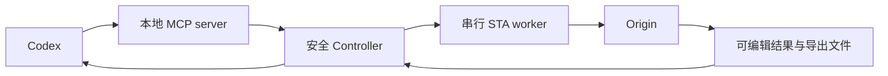

<p align="center">
  
</p>
<h1 align="center">Origin COM Automation</h1>
<p align="center">告诉 Codex 你需要的数据处理、分析和绘图，让它生成可在 Origin 中继续编辑并经过核验的结果。</p>
<p align="center">
  <a href="https://github.com/Dawn-zxj/origin-com-automation/releases/tag/v0.2.3"></a>
  <a href="https://github.com/Dawn-zxj/origin-com-automation/actions/workflows/unit-tests.yml"></a>
  <a href="#requirements"></a>
  <a href="#requirements"></a>
  <a href="docs/VALIDATION-0.2.3.md"></a>
  <a href="#installation"></a>
  <a href="LICENSE"></a>
</p>
<p align="center"><a href="README.md">English</a> | <strong>简体中文</strong></p>

<!-- section:what-it-does -->
## 它能做什么

Origin COM Automation 让 Codex 在后台操作 Origin，同时尽量让结果继续保持 Origin 原生、可编辑。
你可以提供 CSV、Excel 或 OPJU，并说明工作表、列、方法、图形和输出。它可以保留源数据连接，
创建 Origin 公式与原生 Analysis Operation，另存项目、导出图形并核验结果。

<!-- section:capabilities -->
## 主要能力

- 导入 CSV、TSV、XLS、XLSX、XLSM，或打开现有 OPJU 的受保护工作副本。
- 让导入数据继续连接源文件，也可以明确选择断开连接的 snapshot。
- 用 Origin `F(x)` 创建可编辑的计算列。
- 把已验证的 Origin 原生线性拟合保存为可重算的 Analysis Operation；其他方法只有在明确选择、
  清楚标注的兼容路线中才会运行。
- 创建和修改图形，包括数据系列、坐标轴、图例、布局、模板和导出设置。
- 读取和修改工作表、矩阵、Image Page、Notes 和 Project Explorer 文件夹。
- 另存 OPJU，导出 PNG/TIFF/PDF/SVG，预览图形，并核验绑定关系和实际文件。

<!-- section:ask-codex -->
## 告诉 Codex 这六项信息

Codex 可以检查对象名称，但不应替你猜测关键科学选择。

1. **源数据：** CSV、Excel 或 OPJU 路径，以及是否需要保持连接。
2. **工作表：** Excel sheet 名称或要使用的 Origin 工作表。
3. **X 和 Y：** 明确指定 X 列和所有 Y 系列。
4. **范围或分支：** 行范围、扫描方向、筛选条件或正反扫分支。
5. **分析或方法：** 拟合、导数、变换、模型以及关键参数。
6. **图或输出：** 图形类型、样式要求、新 OPJU 路径和导出路径/格式。

<!-- section:examples -->
## 可直接使用的提示词

### 新数据

> 在后台使用 Origin。把 `C:\data\transfer.xlsx` 的 `Data` sheet 作为连接数据导入。
> A 列为 X，B 列为 Y，使用全部行，不做分析。创建可编辑散点图，另存项目到
> `C:\results\transfer.opju`，导出 `transfer.png`，并核验源连接、X/Y 绑定、行数、
> 项目文件和图片。

### 现有 OPJU

> 打开 `C:\data\device.opju` 的工作副本。检查实际工作表和图形名称，只把
> `TransferGraph` 的 Y 轴改为对数轴并刷新图例，保留数据源绑定，另存为
> `C:\results\device-reviewed.opju`，不要覆盖原项目。

### Origin 原生拟合

> 把 `C:\data\calibration.csv` 作为连接数据导入。在导入的工作表中使用 A 为 X、B 为 Y，
> 按现有顺序使用完整列。运行 Origin 原生线性拟合，建立可编辑且自动重算的
> Analysis Operation，绘制数据和拟合曲线，另存 OPJU，并核验 Operation 和图形绑定。

### 多系列图

> 打开 `C:\data\temperature.opju` 的工作副本。在 `[Book1]Data` 中以 A 为 X，B、C、D 为 Y。
> 创建一张多系列线点图，使用彼此清楚且易辨识的颜色、long name 图例和带单位的轴标题，不做分析。
> 导出 PDF 和 600 dpi PNG，然后核验每条曲线的绑定以及两个文件。

更多请求写法和关键操作路线见[用户指南](docs/USER-GUIDE.md)。

<!-- section:installation -->
<a id="installation"></a>
## 安装

从 Git marketplace 安装稳定版插件：

```powershell
codex plugin marketplace add Dawn-zxj/origin-com-automation --ref marketplace
codex plugin add origin-com-automation@origin-automation-marketplace
```

安装后新建 Codex 任务，让新任务加载当前版本的工具和图标。

更新时，先升级 marketplace，再重新安装插件，然后新建 Codex 任务：

```powershell
codex plugin marketplace upgrade origin-automation-marketplace
codex plugin add origin-com-automation@origin-automation-marketplace
```

备用方式：从 [v0.2.3 release](https://github.com/Dawn-zxj/origin-com-automation/releases/tag/v0.2.3)
下载插件 ZIP，解压后运行 `scripts\bootstrap.ps1`，再在 Codex 中安装该本地插件目录。

<a id="requirements"></a>
### 系统要求

- 64 位 Windows，以及 64 位 Python 3.11 或更新版本。
- 当前兼容分支已在 OriginPro 2021 `9.8.0.200` 上完成实机验证。
- 原始上游 v0.2.3 基线已在 Origin 2024b `10.1.0.178` 上实测；当前兼容提交有自动回归覆盖，
  但尚未在 2024b 上重新完成实机遍历。
- Origin 2021b `9.85` 至 2024a 在逐版本实测前仍属于版本相关能力。
- 早于 Origin 2021 `9.8` 的版本、32 位 Origin 和 32 位 Python 不支持。
- 已注册 `Origin.Application`、`Origin.ApplicationCOMSI` 或 `Origin.ApplicationSI` ProgID。
- 支持本地插件和 MCP 的 Codex。

bootstrap 会在 `%LOCALAPPDATA%\OriginComAutomation\runtime\<plugin-version>` 创建按版本隔离的
runtime，不修改系统 Python。

<!-- section:defaults -->
## 安全且可编辑的默认行为

- 导入默认使用 `source_mode="linked"`；只有明确需要断开连接的静态副本时才使用
  `source_mode="snapshot"`。
- 计算列使用 `origin_set_column_formula`，因此计算保留为可编辑的 Origin `F(x)` 公式。
- 已验证的原生路线默认使用 `backend="origin_native"`、`create_operation=true` 和
  `recalculate_mode="auto"`，不会静默改用粘贴 Python 结果的方式。
- 源项目受到保护：普通工作会另存 OPJU，**不会覆盖**源文件。替换源文件需要明确的双重确认、
  hash 检查、重开验证，并默认保留备份。
- 核验集中在决定性数据、绑定、Operation、保存和导出，不会在每个正常步骤后反复完整扫描。
- 不会猜测分支、范围、筛选、模型、约束、导数方法、平滑参数、单位等关键科学参数。
- 出现 `COM_TIMEOUT` 后，使用 `origin_recover_session`，再启动新的插件自有 Origin 会话。

<!-- section:scope-limits -->
## 已验证范围与限制

| 状态 | 含义 |
|---|---|
| 当前分支已验证 | OriginPro 2021 `9.8.0.200`：隔离复测 297 项自动化测试通过（8 项实机 smoke 测试跳过）；源码与安装包各 41/41 项针对性实机检查；FigureSpec 预检与端到端验证；45/45 MCP 工具注册和健康检查。 |
| 上游基线已验证 | 原始 v0.2.3 在 Origin 2024b `10.1.0.178` 上通过；这不等同于当前兼容提交已经在 2024b 上重新实测。 |
| 版本相关 | 通用白名单 X-Function、Analysis Template、专业图形类型、部分布局/模板，以及较少使用的 Matrix/Image/Folder 操作需要能力检查；某些操作还需要明确允许。 |
| 不支持 | 需要认证的远程 Connector、把 PID 差异当作 COM 所有权证明，或只根据观察到的 PID 强制结束 Origin。 |

Origin 2021（9.8）没有真实 Image Page（9.85 才引入），`expGraph` 不支持 SVG，也没有经过验证、
可在不破坏图层/数据绑定的前提下把 OTP 应用到现有图的适配器。这些路径会在修改前返回明确的
版本错误。含 Origin 演示版水印的 PNG/TIFF/PDF 只保留为诊断产物，不会报告为成功交付；插件
不会移除水印或绕过许可证。

插件不会把“没有抛出异常”当成科学结果正确的证据。请用 `origin_capabilities` 检查当前 Origin
版本，并在 [0.2.3 验证记录](docs/VALIDATION-0.2.3.md)中查看准确证据。

<!-- section:troubleshooting -->
## 故障排查

- **仍显示旧图标或旧工具：** 升级 marketplace、重新安装插件并新建 Codex 任务。已有任务会保留
  启动时加载的工具 schema 和资源。
- **Origin 无法启动：** 运行 `scripts\diagnose.ps1`；确认 Python 与 Origin 均为 64 位、ProgID
  已注册，并检查是否有已运行的 Origin 或清理任务造成干扰。
- **连接数据没有刷新：** 确认源路径和 Excel sheet，再让 Codex 检查并刷新 Data Connector。
  snapshot 按设计没有 Connector。
- **超时：** 不要继续向该会话发任务。让 Codex 调用 `origin_recover_session`，再调用
  `origin_start`；修改操作不会被盲目重放。

详细说明见[用户指南](docs/USER-GUIDE.md)和[工具参考](docs/TOOL-REFERENCE.md)。

<!-- section:architecture -->
## 架构



全部工作都在本机完成。Codex 向本地 server 发送结构化请求；一个串行 worker 控制 Origin；
Controller 保护源项目并返回经过回读验证的结果。会话所有权、模块、runtime、错误处理和工作流详见
[架构与安全说明](docs/ARCHITECTURE.md)。

<!-- section:disclaimer -->
## 免责声明

本项目是独立开源项目，**与 OriginLab 不存在隶属、授权或背书关系**。Origin、OriginPro、
LabTalk 和 X-Function 是 OriginLab Corporation 的产品或技术名称，相关名称和商标归各自权利人所有。

本插件属于科研自动化软件，不构成科学、工程、法律、监管或商业建议。在用于论文、决策、器件制备、
测试或其他重要工作前，请务必**备份重要项目和源数据**，并人工**复核并验证输出**。用户需要自行负责
方法、范围、分支、筛选、单位、模型、约束、源数据、模板、许可证和最终解释。

本软件依据 [MIT License](LICENSE) 提供，不附带任何形式的保证。

<!-- section:references -->
## 参考资料

- [用户指南](docs/USER-GUIDE.md)
- [完整工具参考](docs/TOOL-REFERENCE.md)
- [架构与安全](docs/ARCHITECTURE.md)
- [0.2.3 验证记录](docs/VALIDATION-0.2.3.md)
- [Origin 2021 兼容性更新与验证范围](docs/ORIGIN-2021-COMPATIBILITY.md)
- [以往验证：0.2.0](docs/VALIDATION-0.2.0.md)、[0.2.1](docs/VALIDATION-0.2.1.md)和[0.2.2](docs/VALIDATION-0.2.2.md)
- [实验版本存档](docs/EXPERIMENTAL-VERSIONS.md)
- [参考与归属](docs/REFERENCES.md)
- [MIT License](LICENSE)
